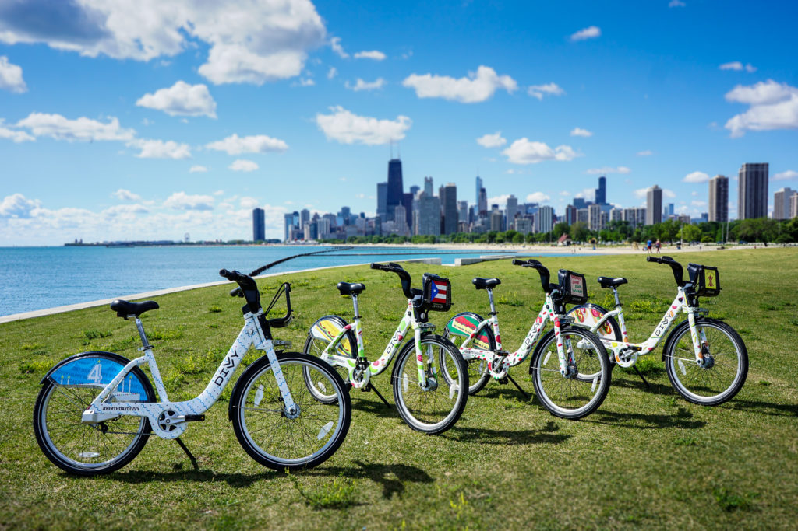
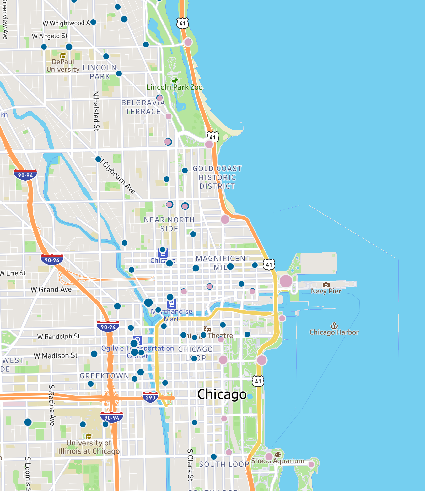

```{r setup, include=FALSE}
knitr::opts_chunk$set(echo=TRUE, warning=FALSE, message=FALSE)
library(bslib)
```

##### Google Data Analytics Professional Certificate capstone case study track one Cyclistic bike-share analysis

 image from: <https://freechicagowalkingtours.com/chicago-divvy-bike-guide/>

## Scenario

You are a junior data analyst working in the marketing analyst team at Cyclistic, a bike-share company in Chicago. The director of marketing believes the company's future success depends on maximizing the number of annual memberships. Therefore, your team wants to understand how casual riders and annual members use Cyclistic bikes differently. From these insights, your team will design a new marketing strategy to convert casual riders into annual members. But first, Cyclistic executives must approve your recommendations, so they must be backed up with compelling data insights and professional data visualizations.

Lily Moreno, the director of marketing at Cyclistics has set the clear goal to design marketing strategies aimed at converting casual riders into annual members. She believes that in order to do that, the marketing analyst team needs to better understand how annual members and casual riders differ, why casual riders would buy a membership, and how digital media could affect their marketing tactics.

For this report, I and my team consolidated the historical Cyclistics bicycle trip data from 2021-22 into one data frame and performed a simple analysis that answers the question "how do members and casual riders use Cyclistic bikes differently?" We then created a plan complete with visualizations for why casual riders would buy a membership, and recommendations for how digital media could affect their marketing tactics. This analysis will help executives to make decisions about marketing programs and strategies to convert casual riders to riders with annual memberships

Just to note: "I and my team," is simply me, since this is an exercise. And, the 2021-22 Cyclistics data set is actually 2021-22 Chicago Divvy bike data.

## Data Source

The data is 12 consecutive months of historical trip data made available to the public by Cyclistics. It is second-party data as collected by Motivate, a company employed by the City of Chicago to collect data on bike share usage (license: [Divvy Data License Agreement](https://www.divvybikes.com/data-license-agreement)). For data-privacy each trip is anonymized and wiped of payment information. This means that the data set is less helpful as it cannot be used to correlate the demographics and logistics of the homes of casual riders, member riders, and their usage of Cyclistic bikes. It also cannot be used to determine:

-   if customers have purchased multiple single passes
-   if certain rider demographics use specific kinds of bikes
-   how many people are actually represented by the data set

Also, the team was not provided with the costs of passes and memberships and therefore cannot determine any true cost saving value for using one method over another.

The data is housed at: [Divvy Data](https://divvybikes.com/system-data). It was downloaded on June 26, 2023 at 13:36.

## Deliverables

| Deliverable Description                                       | Details                                                                                                                                                            |
|:-------------------------|:---------------------------------------------|
| Documentation of cleaning and manipulation of data (analysis) | Because this analysis is a case study performed for a portfolio, I repeated the cleaning and analysis process in three separate formats: PostgreSQL, R, and Excel. |
| Charts                                                        | Data visualizations comparing the usage of rider by type. Again, this is performed in three separate formats: R, Tableau, and Excel.                               |
| Recommendations                                               | Recommendations as to why the differences.                                                                                                                         |
| Final Report                                                  | A report highlighting the differences between rider types and how these differences suggest actions for successful future marketing.                               |

## Tools Used for Analysis and Visuals

-   For cleaning, analysis, and visuals in Excel contact me

-   For cleaning and analysis in [SQL](https://rpubs.com/Nisaba/Cyclistics_2021_2022_SQL) using PostgreSQL

-   For dashboard in [Tableau](https://public.tableau.com/app/profile/nisaba/viz/HowdoCasualRidesDifferfromMemberRides/Dashboard1)

-   For cleaning, analysis, and visuals in [R](https://rpubs.com/Nisaba/Cyclistics_2021-2022_R) using RStudio


## Analysis

### Ask

1.  How do members and casual riders use Cyclistic bikes differently?
2.  Why would casual riders buy a membership?
3.  How digital media could affect Cyclistic marketing tactics?

### Prepare

See above section: Tools Used for Analysis and Visuals

#### Observed advantages to data set

After checking out the data frame for contents, type/case of columns, and organization it became apparent that it is highly structured and that after some simple cleaning, it can easily be divided, measured, and quantified (aggregated) to reveal differences in usage between ride types.

#### Observed disadvantages to data set

As noted above, for data-privacy reasons the data contains no payment information and so cannot be used to correlate the demographics and logistics of the homes of casual riders, member riders, and their usage of Cyclistic bikes. It also cannot be used to determine if customers have purchased multiple single passes and if certain rider demographics use specific kinds of bikes. This means that casual rides may account for far more individuals using the service than member riders. Thus, because there are more member rides, yet likely representative of fewer customers, and fewer casual rides, yet likely representative of more customers, the analysis cannot be as customer specific as it could be. Finally, the data does not give age, sex, or gender. If recorded accurately, this information could be useful in marketing.

### Process (wrangling, cleaning, and transformation)

See above section: Tools Used for Analysis and Visuals

### Visualize, Analyze, and Share

See above section: Tools Used for Analysis and Visuals

## THE STORY

#### General Use

Cyclistics is a very popular service with a total ride count of almost four and a half million rides taken during the 2021-2022 fiscal year. Causal rides make up 40% of these rides:


| user type  | total       | percent |
|:-----------|:------------|:--------|
| **casual** | **1779144** | **40%** |
| member     | 2618743     | 60%     |

(We must state that these numbers do not represent a one to one correspondence where one ride is equal to one rider. Because we did not have access to membership rolls or credit card data for privacy concerns we cannot ascertain how many members 2,618,743 rides represent. Members might take advantage of the service multiple times in a week and so the total number of actual members represented by the over one million and a half rides is likely a much smaller number. The case is likely less severe with Casual users, since they are using the service ad hoc, however, without further data, it is impossible to know how many casual rides represent repeat customers or one offs.)

With this said, let's see how the habits of Member and Casual riders compare.


For starters, the percentage of member rides is much higher eight months out of the year. Casual rides, represented in red, are generally not taken in winter and the shoulder months, fall and spring as illustrated by the low bars on the right and left sides of the graph.


When examined by ride count, it can again be seen that the summer months are far more popular with both casual and member cyclists. Casual rides almost match the percentage of member rides.

The most and least popular months for users to take casual rides was January:

| user type  | month   | total rides | percent |
|:-----------|:--------|:------------|:--------|
| **casual** | **Jan** | **12461**   | **16%** |
| member     | Jan     | 66554       | 84%     |

The most popular month for users to take casual rides was July. For member rides, this was August:

| user type | month  | total rides | percent |
|:----------|:-------|:------------|:--------|
| casual    | July   | 306378      | 49%     |
| member    | August | 328365      | 55%     |

If we examine the percentage of rides by week day, we also see a difference between casual rides and member rides.


Although the percentage of casual rides goes down during the week on average, the percentage of casual rides on the weekends is higher than those of members. On weekends, casual rides account for more total rides than member rides.

| user type | day | total rides | percent |
|:----------|:----|:------------|:--------|
| casual    | Sun | 309192      | 51%     |
| member    | Sun | 296518      | 49%     |

| user type | day | total rides | percent |
|:----------|:----|:------------|:--------|
| casual    | Sat | 382420      | 53%     |
| member    | Sat | 344044      | 47%     |

#### Trip Duration


Turning now to trip duration, we can note that the minimum and maximum duration of either a Casual user or Members trip is comparable. However, the average duration of a casual trip is well over twice as long as that of a member trip, regardless of month:

| user type | average ride duration | min ride duration | max ride duration |
|:----------|:----------------------|:------------------|:------------------|
| casual    | 24 minutes            | 1                 | 1439              |
| member    | 12 minutes            | 1                 | 1435              |

Or, by day of the week:


#### Quick points

So, at this point, the data informs us that:

-   casual rides make up 40% of all total rides

-   these rides are more likely to be taken on the weekends or during the summer months

-   they last twice as long as member rides regardless of season, month, or day of the week

#### Bike Type

Our next questions are about the type of ride casual riders choose and what start station is their most preferred.

Cyclistics offers three types of bicycles for rent: classic, docked, and electric.

The total percentage for the use of each, breaks down:

-   60% of all rides take place on classic bikes

-   35% on electric bikes,

-   only 4% on docked

(This last percentage may have more to do with availability, which was outside the purview of this study.)

When broken down by user type, we see similar usage rates:

{width="264"}

Although casual riders were the only rider type to rent docked bikes, both Casual and Member users chose electric bikes 30% of the time. When we break this down by total use, we see that member rides accounted for 40% of all classic bike rentals.

| user_type | bike type     | ride count | average ride duration | percent |
|:----------|:--------------|:-----------|:----------------------|:--------|
| casual    | classic bike  | 925549     | 24 minutes            | 21%     |
| casual    | docked bike   | 188124     | **48** minutes        | 4%      |
| casual    | electric bike | 665471     | 17 minutes            | 15%     |
|           |               |            |                       |         |
| member    | classic bike  | 1770016    | 13 minutes            | **40%** |
| member    | electric bike | 848727     | 11 minutes            | 19%     |

Also of note is that there is little difference between the average amount of time Member users spent on either classic or electric bikes, however Casual users spent on average 48 minutes on docked bikes. This is twice the amount of time they spent using electric bikes.

#### Trip Type

While on Cyclistic bikes far more than Members, Casual users took round trips. In fact, twice as often and for twice as long. Although member round trips took an average of 22 minutes, casual rides were 42 minutes.

| user type  | round trip? | number of rides | average duration |
|:-----------|:------------|:----------------|:-----------------|
| **casual** | TRUE        | **154176**      | **42 minutes**   |
| member     | TRUE        | 72348           | 22 minutes       |

#### What are the top start stations for ride types?

For this analysis, we also identified the most popular start stations for casual and member rides. These were starkly different. Member rides predominantly demonstrate a commuter mentality, while casual rides demonstrate a far more relaxed enjoyment usage.

{width="535"}

##### Casual rides

As can be seen on this map, the most popular start stations for casual rides - represented in pink - were at iconic Chicago tourist locations.

-   Almost 55,000 rides started at Navy Pier

-   25,000 at Millennium Park

-   close to 20,000 at the Shedd aquarium

Also, since top start stations are either on or directly off of the Lakefront trail and had trips with average durations of between 30 and 40 minutes, it can be concluded that these were pleasure rides.

| start station name                 | number of rides | average duration |
|:-----------------------------------|:----------------|:-----------------|
| Streeter Dr & Grand Ave            | 54792           | 37 minutes       |
| DuSable Lake Shore Dr & Monroe St  | 30270           | 37 minutes       |
| Millennium Park                    | 25080           | 41 minutes       |
| Michigan Ave & Oak St              | 23659           | 37 minutes       |
| DuSable Lake Shore Dr & North Blvd | 22130           | 30 minutes       |
| Shedd Aquarium                     | 19293           | 31 minutes       |

Perhaps not unsurprisingly the most popular destination of casual users who start at the Lakefront Trail station use bikes for round trips taking an average 2.7 hours to complete the trip.

| start station name      | end station name                   | number of rides |
|:---------------------|:------------------------------|:------------------|
| Streeter Dr & Grand Ave | Streeter Dr & Grand Ave            | 9673            |
| Streeter Dr & Grand Ave | DuSable Lake Shore Dr & Monroe St  | 2899            |
| Streeter Dr & Grand Ave | Millennium Park                    | 2873            |
| Streeter Dr & Grand Ave | Michigan Ave & Oak St              | 2366            |
| Streeter Dr & Grand Ave | DuSable Lake Shore Dr & North Blvd | 2151            |

The second most popular end stop for this start station is also on the Lakefront Trail, as are three more of the end stations. 2 of these 3 are on north of the Shedd, with only one just to the south.

##### Member rides

Conversely, the most used start stations for member rides are at transit hubs.

Two of the most used stations are at the transportation depots:

-   Ogilvie Transportation Center (Clinton St & Washington Blvd)

-   Chicago Union Station(Clinton St & Madison St)

Three are on Elm st. in the Gold Coast Historic district, which is home to the Newberry library (Clark St & Elm St, Wells St & Concord Ln, and Wells St & Elm St).

| start station name           | number of rides | average duration |
|:-----------------------------|:----------------|:-----------------|
| Kingsbury St & Kinzie St     | 24567           | 9 minutes        |
| Clark St & Elm St            | 21451           | 12 minutes       |
| Wells St & Concord Ln        | 20645           | 12 minutes       |
| Clinton St & Washington Blvd | 18654           | 11 minutes       |
| Clinton St & Madison St      | 18483           | 11 minutes       |

The least used stations by all riders were public racks. Since we were not given information as to the meaning of public racks, we do not know their purpose, only that they seem to be located in residential areas.

### Key Findings

The key findings from our analysis are that Casual and Member riders differ significantly in their use of Cyclistics bike ride sharing service.

-   Casual rides were leisure oriented
-   Member rides were commuter oriented
-   Casual rides were 50% longer than member rides regardless of day or month taken
-   Percentage of casual rides was far higher during the summer and equal in percentage to member rides
-   Percentage of casual rides was far higher on weekends, slightly higher than member rides
-   Top origination stations for casual rides were along the Lakefront Trail at various tourist attractions
-   Top origination stations for member rides were at transportation hubs

### Recommended actions

Highlight member value proposition through online messaging to increase conversion of casual riders

-   Membership offers lower cost per trip due to unlimited use time
-   Leverage high causal rider incidence at key stations near tourism locations
-   Consider banner ad placement and paired search terms associated with tourism to drive traffic to site
